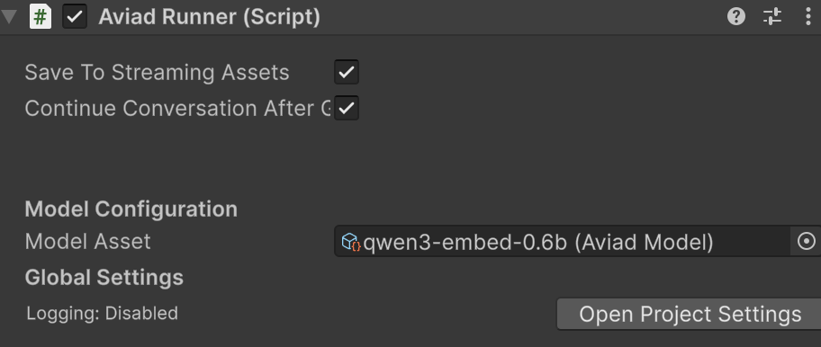

    

    <h1 align="center">
        Aviad AI For Unity
    </h1>
    <h3 align="center">
        Local models for dynamic game characters in Unity.
    </h3>

    
    &nbsp;
    

    
    &nbsp;
    
    &nbsp;
    

## Overview
At Aviad, we're focused on bringing small models to games. Small speech and language models are capable game assets that bring all the benefits of AI while being small 
enough to run locally on CPU and more controllable through finetuning. They have the added advantage of supporting low-end systems and not competing with a game's graphics needs.

This package is an easy way to integrate local models into the Unity engine. It runs on top of a build of [llama.cpp](https://github.com/ggml-org/llama.cpp). The native code has only been built to run on CPU. Please reach out if you'd like GPU support.

## Finetune your own voice models

Our first product helps you finetune your own voice models to bring characters to life. Create an account at [aviad.ai](aviad.ai) and read through a short guide at [docs.aviad.ai](docs.aviad.ai) to get started. Then use this package to load your custom model into Unity.

## Platform Support

This package should support Windows, MacOS, and WebGL. Please create an issue if you run into trouble! Or join our [Discord](https://discord.gg/Jk4jUYghnA).

## Setup

1. Add via Unity Package Manager. `Window -> Package Manager`.

2. In the top left, click `+` and then `Install package from Git URL...`

3. Enter https://github.com/aviad-ai/unity.git in the text field that appears. Click `Install`.

4. `Packages/manifest.json` should contain a line like:

`    "ai.aviad.core": "https://github.com/aviad-ai/unity.git",`

You may pin to a version or commit like below:

`    "ai.aviad.core": "https://github.com/aviad-ai/unity.git#0.2.0",`

## Usage

#### 1. Attach the `AviadRunner` component to your game. `AviadRunner` is an interface for configuring how the model is run.
* Create an empty GameObject.
* Add component and select `AviadRunner`

#### 2. Configure `AviadRunner` in the inspector view.
* Create a new AviadModel asset to hold the model settings. Or use an existing one from the package.
* Set `Model Asset` field.
* Open the AviadModel asset and click *Download Model*

#### 3. Implement a script to interface with `AviadRunner`. At a high level, these methods will set up and run the model:
* Call `AddTurnToContext` to add to the model's context at runtime. Example usage:

  `aviadRunner.AddTurnToContext("system", "You are a helpful assistant.");`
  
  `aviadRunner.AddTurnToContext("user", "What's 2+2?");`

* Call `Generate` to receive streaming output from the model given the current context. After generation, the active context will include the model's output. `Generate` takes onUpdate and onDone functions that you can implement to specify things like how the generated text will get displayed, what other game mechanics are triggered, etc.
* Call `Reset` to clear the current conversation context completely.

## Reach Out
Star ⭐ this project and join us on [Discord](https://discord.gg/Jk4jUYghnA)! We post about the latest feature releases there.
